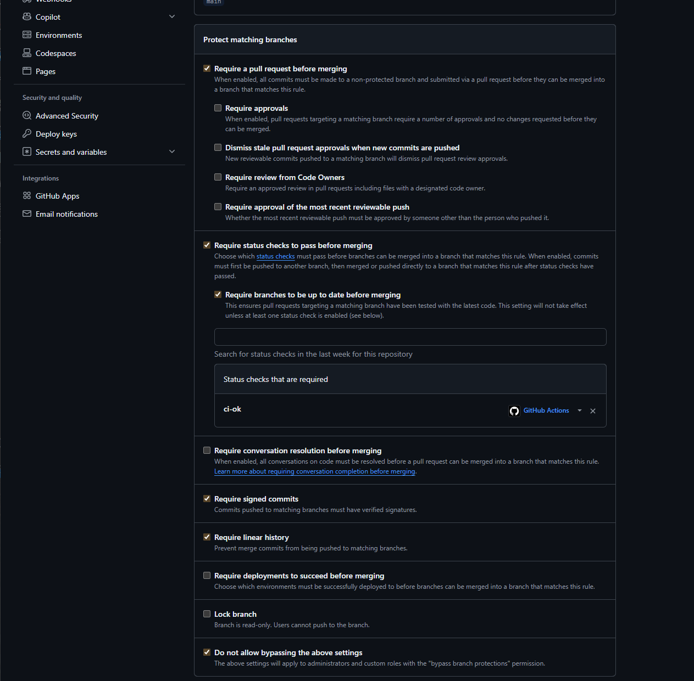
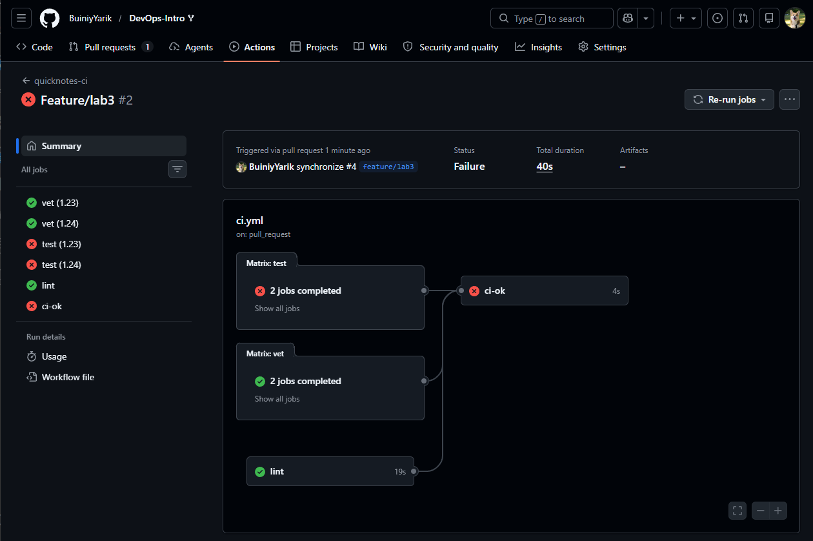
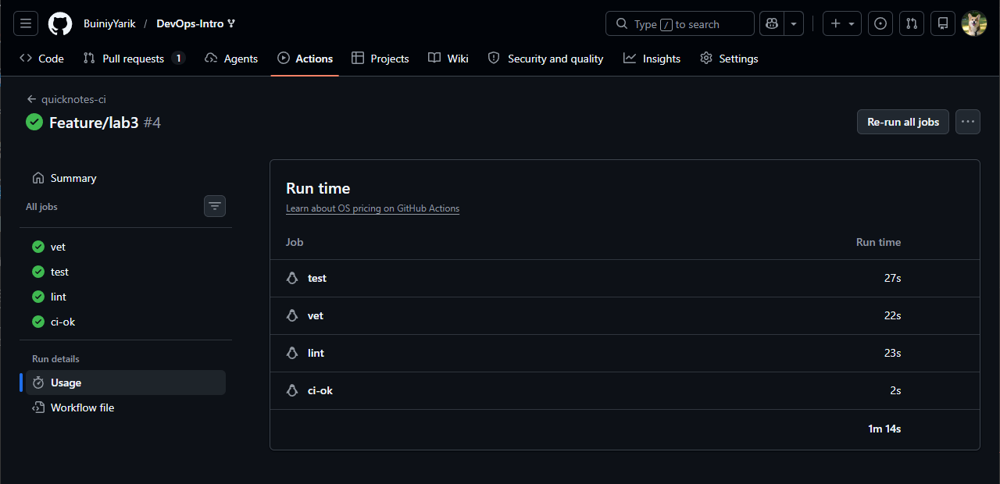
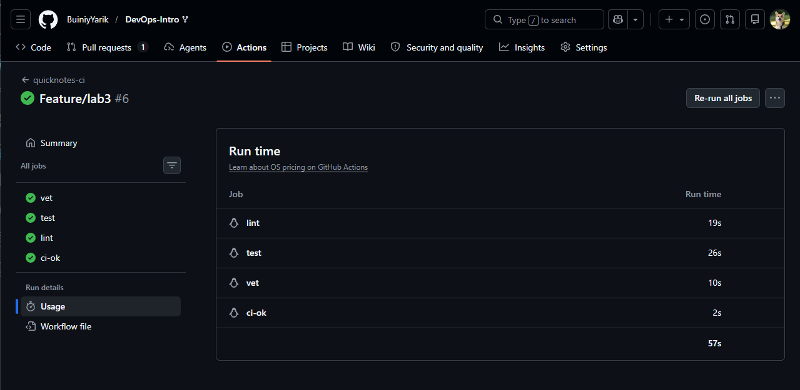
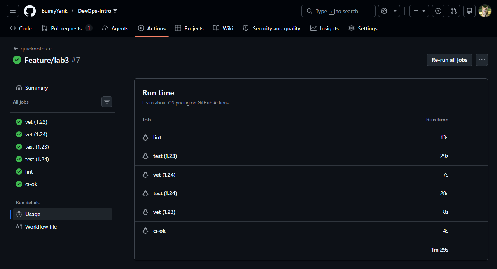

# Lab 3 Submission

## Task 1. CI Pipeline

### Workflow Overview

I implemented a GitHub Actions CI pipeline for QuickNotes.

The workflow performs the following checks:

- `go vet`
- `go test -race -count=1 ./...`
- `golangci-lint`
- aggregate `ci-ok` status check

The workflow is triggered on:

- Pull Requests targeting `main`
- Pushes to `main`

Actions are pinned to immutable commit SHAs rather than floating tags.

### Green CI Run

Workflow run:

https://github.com/BuiniyYarik/DevOps-Intro/actions/runs/27637205088

Screenshot:


### Branch Protection

The `main` branch is protected using GitHub branch protection rules.

Configured protections:

- Require a pull request before merging
- Require status checks to pass before merging
- Require branches to be up to date before merging

Screenshot:



### Failed CI Demonstration

To verify that the pipeline correctly blocks broken code, I intentionally introduced a failing test.

Commit:

```text
28ffa8d test(lab3): deliberately break CI
```

The failing commit caused the following checks to fail:

- test
- ci-ok

Screenshot:



### Recovery

The failure was fixed by reverting the intentional change.

Commit:

```text
83a5713 Revert "test(lab3): deliberately break CI"
```

After the revert, all CI checks passed successfully again.

### Merge Protection

When CI checks fail, GitHub prevents merging code that does not satisfy repository requirements.

Screenshot:


---

## Task 2. CI Performance Investigation

### Timing Measurements

The following measurements were collected from GitHub Actions workflow runs.

| Scenario | Wall-clock |
|----------|------------|
| Baseline (no cache, single Go version, no path filter) | 1m 14s |
| With cache | 57s |
| With cache + matrix | 1m 29s |

Screenshots:







### Optimization Results

| Optimization applied | Before (s) | After (s) | Saving |
|----------------------|-----------:|----------:|--------:|
| Go cache | 74 | 57 | 17 |
| Parallel vet/test/lint jobs | 74 | 57 | 17 |
| Path filters for docs-only changes | 57 | 0 | Entire workflow skipped |
| Stable `ci-ok` aggregate check | N/A | N/A | Reliability improvement |

### Performance Analysis

The measurements show that Go dependency caching provided a modest reduction in total workflow duration. QuickNotes has very few external dependencies, therefore dependency downloads are not the dominant cost.

The matrix configuration increased the total wall-clock runtime because two Go versions are tested simultaneously. Although additional jobs are executed, the benefit is increased confidence that the project works correctly across multiple Go releases.

Path filters provide the largest practical improvement for developer productivity. Documentation-only changes can avoid running the entire CI workflow, eliminating unnecessary waiting time.

The `ci-ok` job is not primarily a performance optimization. Instead, it provides a stable aggregate status check that branch protection rules can depend on without referencing matrix-generated job names.

### Bottleneck Analysis

The remaining dominant cost is runner provisioning and Go/tool setup rather than actual QuickNotes tests. QuickNotes has almost no dependency download work, so dependency caching has limited effect on total wall-clock time. The actual `go vet` and `go test` commands are short; most time is spent before the application code is checked. The lint job is usually the heaviest application-level job because it has to set up and run `golangci-lint`. I would stop optimizing once the PR feedback loop is consistently below 90 seconds, because further savings would likely require more complex infrastructure than this small project needs.

---

## Reflection

This lab demonstrated how CI pipelines can automatically enforce code quality requirements before changes reach protected branches. Combining branch protection with automated testing significantly reduces the risk of introducing broken code into the main development line.

The exercise also showed the tradeoff between confidence and execution speed. Features such as testing multiple Go versions increase runtime slightly, but they provide stronger guarantees that software behaves correctly in different environments.

Finally, measuring workflow performance highlighted that optimization should focus on the actual bottlenecks. For a small Go project such as QuickNotes, infrastructure startup and tool initialization dominate execution time more than compilation or testing itself.