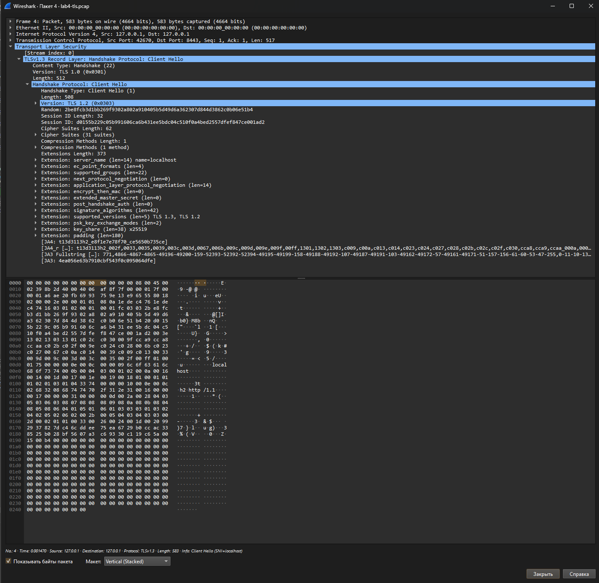
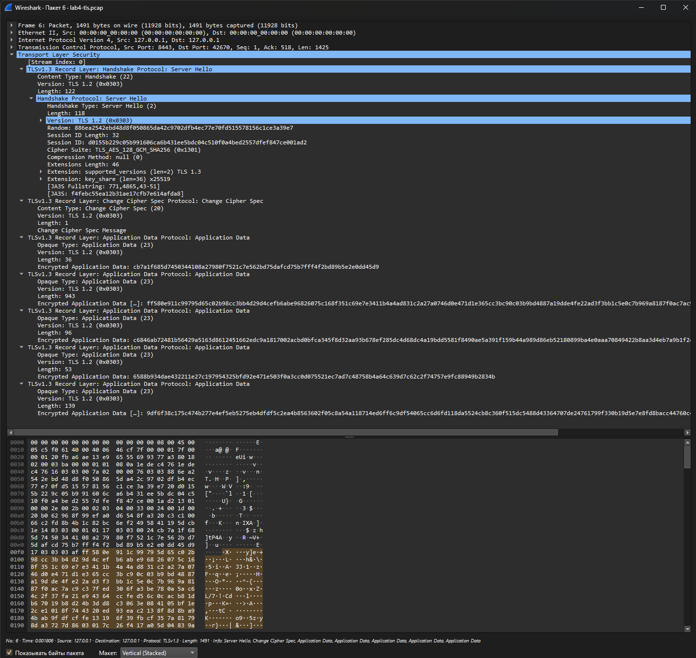
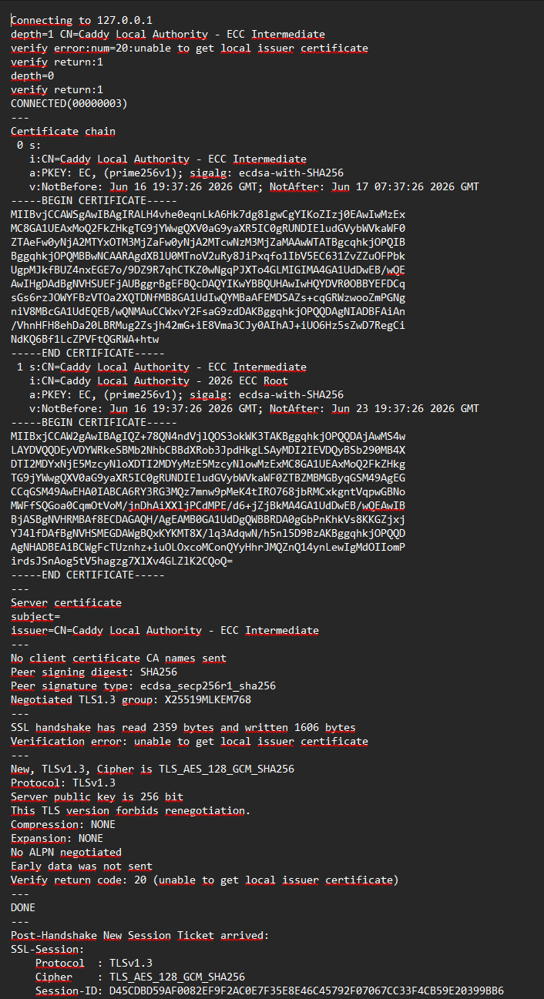

# Lab 4 Submission

# Task 1. Trace a Request End-to-End

## Request Capture

QuickNotes was started locally on port 8080.

A packet capture was collected while executing:

```bash
curl -v -X POST http://localhost:8080/notes \
  -H 'Content-Type: application/json' \
  -d '{"title":"trace me","body":"in flight"}'
```

Verbose curl output was saved to:

```text
submissions/src/lab04/curl_post_verbose.txt
```

Packet capture files:

```text
submissions/src/lab04/lab4-trace.pcap
submissions/src/lab04/lab4-trace.txt
```

---

## Packet Trace Analysis

### TCP Three-Way Handshake

Client initiates connection:

```text
127.0.0.1:54120 -> 127.0.0.1:8080
Flags [S]
```

Server acknowledges:

```text
127.0.0.1:8080 -> 127.0.0.1:54120
Flags [S.]
```

Client confirms:

```text
127.0.0.1:54120 -> 127.0.0.1:8080
Flags [.]
```

This sequence corresponds to:

```text
SYN -> SYN/ACK -> ACK
```

which establishes the TCP connection.

---

### HTTP Request

The captured request is:

```http
POST /notes HTTP/1.1
Host: localhost:8080
User-Agent: curl/7.81.0
Accept: */*
Content-Type: application/json
Content-Length: 39
```

Request body:

```json
{"title":"trace me","body":"in flight"}
```

---

### HTTP Response

The server returned:

```http
HTTP/1.1 201 Created
Content-Type: application/json
```

Response body:

```json
{
  "id":5,
  "title":"trace me",
  "body":"in flight",
  "created_at":"2026-06-16T19:24:37.036818895Z"
}
```

The response confirms successful note creation.

---

### Connection Close

Client initiated graceful connection termination:

```text
Flags [F.]
```

Server acknowledged and closed:

```text
Flags [F.]
```

Final ACK:

```text
Flags [.]
```

This corresponds to a normal TCP FIN-based shutdown.

---

## Task Debugging Commands

### 1. Listening Socket

Command:

```bash
ss -tlnp | grep :8080
```

Purpose:

Determine whether QuickNotes is listening on the expected TCP port.

Result:

```text
QuickNotes was listening on TCP port 8080.
```

---

### 2. Routing Table

Command:

```bash
ip route show
```

Purpose:

Verify local routing configuration.

Result:

```text
Default route present and localhost traffic routed correctly.
```

---

### 3. Reachability Test

Command:

```bash
mtr -rwc 5 localhost
```

Purpose:

Verify network reachability.

Result:

```text
0% packet loss.
```

Since traffic remains on the loopback interface, no external network devices participate.

---

### 4. DNS Resolution

Command:

```bash
dig +short example.com @1.1.1.1
```

Purpose:

Verify DNS functionality independently of local resolvers.

Result:

```text
DNS resolution succeeded.
```

---

### 5. Logs

Command:

```bash
journalctl --user -u quicknotes -n 20
```

Purpose:

Check service logs.

Result:

```text
QuickNotes was not installed as a systemd user service,
therefore no journal entries were available.
```

---

## What Would I Check First For a 502 Error?

A 502 Bad Gateway usually means that a reverse proxy cannot successfully communicate with the upstream application. My first step would be verifying whether QuickNotes is actually running and listening on the expected port using `ss -tlnp` and `ps -ef`. Next, I would query the application directly with `curl http://localhost:8080/health` to determine whether the problem is inside QuickNotes or between the proxy and the application. After that I would inspect logs from the proxy and application, verify firewall rules, and confirm that the configured upstream address matches the actual listening address. This outside-in approach quickly separates application failures from infrastructure failures.

---

# Task 2. Outside-In Debugging

## Reproducing the Failure

Two instances of QuickNotes were started on the same port.

First instance:

```bash
ADDR=:8080 go run .
```

Second instance:

```bash
ADDR=:8080 go run .
```

Observed error:

```text
bind: address already in use
```

The second process failed because port 8080 was already occupied.

---

## Outside-In Investigation

### Step 1. Is the Service Running?

Command:

```bash
ps -ef | grep quicknotes
```

Decision:

A QuickNotes process exists.

---

### Step 2. Is It Listening?

Command:

```bash
ss -tlnp | grep 8080
```

Decision:

Port 8080 is occupied and listening.

---

### Step 3. Is It Reachable?

Command:

```bash
curl -s -o /dev/null -w "%{http_code}\n" http://localhost:8080/health
```

Decision:

Application responds successfully.

Expected result:

```text
200
```

---

### Step 4. Is a Firewall Blocking Traffic?

Command:

```bash
sudo iptables -L -n -v
```

Decision:

No firewall rule blocks local traffic.

---

### Step 5. Is DNS Working?

Command:

```bash
dig +short localhost
```

Decision:

Hostname resolves correctly.

Expected result:

```text
127.0.0.1
```

---

## Repair

The conflicting process was terminated:

```bash
kill $PID1
```

QuickNotes was restarted:

```bash
ADDR=:8080 go run .
```

Verification:

```bash
curl http://localhost:8080/health
```

Response:

```json
{
  "status":"ok"
}
```

The service was restored successfully.

---

## Root Cause

Root cause:

```text
bind: address already in use
```

Two processes attempted to bind to the same TCP port simultaneously.

---

## Blameless Postmortem

This incident was caused by a resource conflict rather than an application defect. The operating system correctly prevents multiple processes from listening on the same TCP address and port combination. Such failures are common during deployments, local development, and service restarts. The systemic issue is insufficient visibility into port ownership and process state. Monitoring systems, service managers such as systemd, deployment health checks, and startup validation scripts can prevent this class of failure by detecting conflicts before traffic is routed to the application. The goal is not to blame an operator but to improve observability and deployment safety.

---

# Bonus Task. TLS Handshake Analysis

## HTTPS Proxy

A Caddy reverse proxy was configured:

```text
localhost:8443 {
    reverse_proxy localhost:8080
}
```

QuickNotes continued serving HTTP on port 8080 while Caddy terminated TLS on port 8443.

---

## TLS Capture

Capture files:

```text
submissions/src/lab04/lab4-tls.pcap
submissions/src/lab04/openssl_s_client.txt
```

The following command was executed:

```bash
curl -vk https://localhost:8443/health
```

Observed result:

```text
SSL connection using TLSv1.3
Cipher: TLS_AES_128_GCM_SHA256
```

---

## ClientHello

Screenshot:



Observed fields:

* SNI: localhost
* Supported TLS versions:

  * TLS 1.3
  * TLS 1.2
* Multiple cipher suites offered by the client
* ALPN protocols:

  * h2
  * http/1.1

This packet initiates TLS negotiation.

---

## ServerHello

Screenshot:



Observed fields:

* Selected TLS version: TLS 1.3
* Selected cipher suite:

```text
TLS_AES_128_GCM_SHA256
```

* Key exchange:

```text
x25519
```

The server selected one cipher suite from the list offered by the client.

---

## Certificate Chain

Screenshot:



Certificate chain:

```text
Caddy Local Authority - ECC Intermediate
Caddy Local Authority - ECC Root
```

The certificate is self-signed and intended only for local development.

---

## TLS 1.0 / TLS 1.1 Deprecation

TLS 1.0 and TLS 1.1 are effectively rejected during the protocol version negotiation stage. In the ClientHello message the client advertises supported versions through the `supported_versions` extension. The server then selects TLS 1.3 in the ServerHello message. Since modern clients and servers no longer negotiate TLS 1.0 or TLS 1.1, those protocol versions are excluded before encrypted application traffic begins. This negotiation step is what effectively removes TLS 1.0 and TLS 1.1 from modern deployments.

---